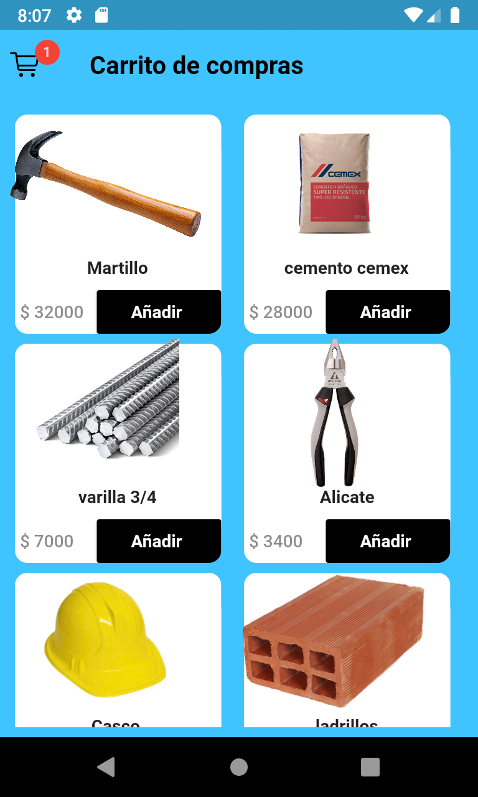
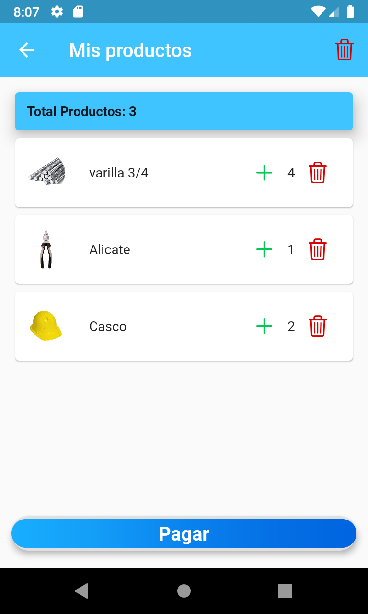

# Carrito Compras test
Esta es una aplicacion construida en flutter la cual es un carrito de compras:

Carrito : Muestra el carrito de compras con el total de productos el cual puede eliminar, agregar o vaciar el carrito de compras.
Home : Muestra un  lista de productos las cuales se caragan desde firebase, se pueden añadir productos al carrito y ir al dicha vista.

1. Consume los servicios de Firebase
2. Utiliza patrones de desarrollo MVVM se utilizó BLOC .
3. Contiene una Clean Architecture por temas de escalabilidad.

Finalmente esta app es realizada solo para fines demostrativos.

# Screenshots
{:height="20%" width="20%"}
{:height="20%" width="20%"}

# Información Personal

**Nombre**: Jeisson Santacruz.
**Profesion **: Ingeniero de sistemas y ciencias de la computacion.
** Tecnologias** : Flutter, React Native, PHP, Node js, JavaScript, GraphQl.
** Contacto** : jeissonsanta132@gmail.com
